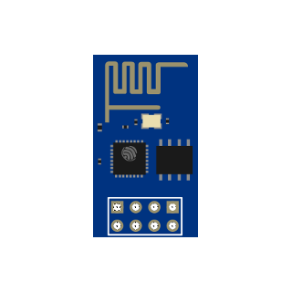
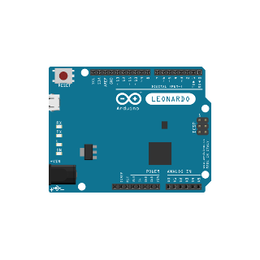
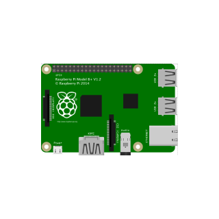
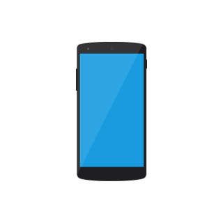
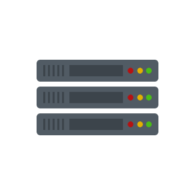
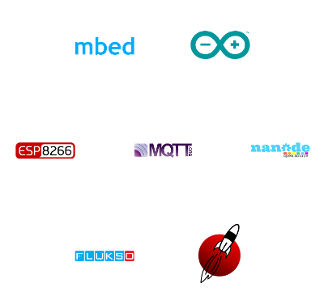
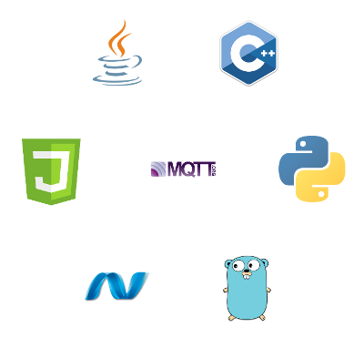
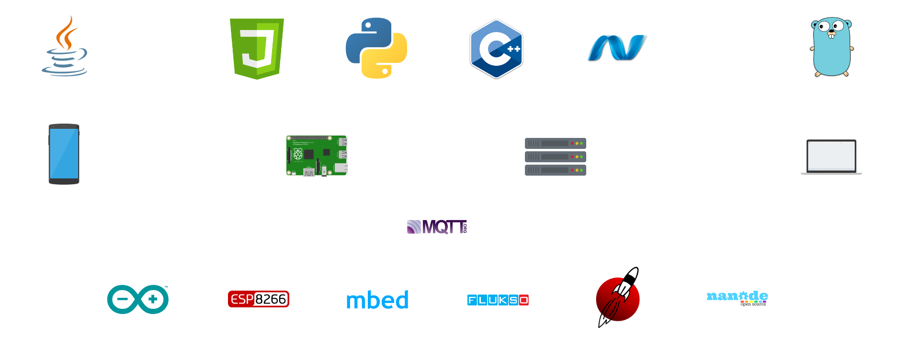

# MQTT is awesome!
MQTT from a practical perspective

!SLIDE

## MQTT
“_MQTT is a machine-to-machine/Internet of Things connectivity protocol_”

<small>[MQTT.org](http://mqtt.org)</small>

!SUB
### My one line description
A lightweight, scalable and portable pub/sub based message protocol that's very easy to implement

!SLIDE

## Lightweight & Portable

!SUB <!-- .element: data-transition="none" -->

## Microcontrollers
 <!-- .element: class="round" -->

!NOTE
The basic implementations are in C, just like any other piece of software this will run no problem on a Raspberry Pi.
But because it's so lightweight it's possible to run it on memory, CPU and power limited devices as well. It basically runs anywhere.

!SUB <!-- .element: data-transition="none" -->

## Microcontrollers
 <!-- .element: class="round" -->

!SUB <!-- .element: data-transition="none" -->

## Single board computers
 <!-- .element: class="round" -->

!SUB <!-- .element: data-transition="none" -->

## Mobile
 <!-- .element: class="round" -->

!SUB <!-- .element: data-transition="none" -->

## PC
 <!-- .element: class="round" -->

!SUB <!-- .element: data-transition="none" -->

## Server
 <!-- .element: class="round" -->

!SLIDE
## Scalable

!SUB
## Real-world use
Used as the message protocol for Facebook Messenger

<small>[Lucy Zhang @ Facebook](https://www.facebook.com/notes/facebook-engineering/building-facebook-messenger/10150259350998920)

!SUB
## Low on resources
Hundreds of thousands of concurrent connections easily possible for a single broker

<small>[Henrik Sjöstrand @ IBM](http://www.slideshare.net/henriksjostrand/devmobile-2013-low-latencymessagingusingmqtt#10)</small>

!SLIDE
## Easy to implement

!SUB
## Microntroller support

!SUB
## Microntroller support
#### embedded
- ANSI C client
- Higher level C & C++ clients

!SUB
## Microntroller support
#### Device specific
- Arduino
- ESP8266
- mbed
- Launchpad
- etc.

!SUB
## Programming language support

!SUB
## Programming language support
Basically every language has an MQTT library :)

!SLIDE
## MQTT & IoT
### A perfect match

!SUB
## Current state of IoT

Vendor controlled market

&#8595;<!-- .element: class="fragment" data-fragment-index="1" -->

Vendor specific protocols and implementations<!-- .element: class="fragment" data-fragment-index="2" -->

&#8595;<!-- .element: class="fragment" data-fragment-index="3" -->

No interoperability<!-- .element: class="fragment" data-fragment-index="4" -->

!SUB
## MQTT to the resque
MQTT is the perfect "glue" to wire all these disconnected things together

!SUB

!SUB
## Well this seems familiar
It's basically a microservice & polyglot architecture for IoT ;)

!SLIDE
## Also

- QoS support
- Websocket support integrated into several brokers

!SLIDE
## Interested?

!SUB
## Get started!

- Get a [broker](https://github.com/mqtt/mqtt.github.io/wiki/servers)
  - Mosquitto comes recommended
    - [simonvanderveldt/mosquitto](https://registry.hub.docker.com/u/simonvanderveldt/mosquitto/) Docker image
- Get a [client library](https://github.com/mqtt/mqtt.github.io/wiki/libraries) for your platform/language of choice
- Start coding!
